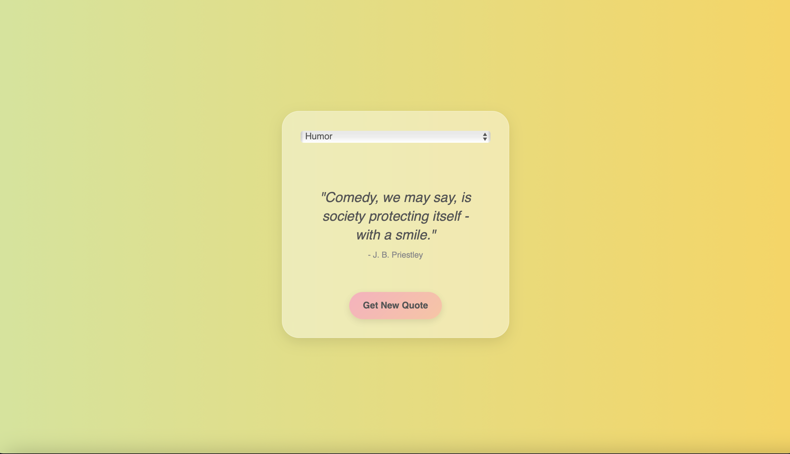

# Elegant Random Quote Generator

An aesthetically pleasing and interactive random quote generator designed to fetch quotes from various categories and display them with smooth animations and a dynamic, changing gradient background. Users can select a quote category and retrieve motivational, humorous, or artistic quotes with a seamless experience. The quotes are fetched from the API Ninjas Quotes API and displayed with real-time font adjustments to fit the screen.

## Table of Contents

- [Overview](#overview)
- [Features](#features)
- [Technologies Used](#technologies-used)
- [Concepts Covered](#concepts-covered)
- [Learning Objectives](#learning-objectives)
- [Future Improvements](#future-improvements)
- [Summary](#summary)

[Demo](https://brockaltug.github.io/random-quote-generator)

## Overview

The Elegant Random Quote Generator is a web-based application that delivers quotes from different categories, including inspiration, humor, and success, with an elegant interface. Users can select from a dropdown menu to change categories, and the app dynamically fetches new quotes with smooth transitions. It also features an animated gradient background to enhance the visual experience. The application is mobile-friendly and responsive, providing a delightful user experience.

## Features

- **Category-Based Quotes**: Users can select from a range of categories (e.g., Inspirational, Art, Humor) to retrieve specific types of quotes.
- **Dynamic Background**: The background changes its gradient color based on the selected category, adding a vibrant, animated effect.
- **Loading Spinner**: A spinner is displayed while the app fetches quotes from the API.
- **Responsive Design**: The quote generator is fully responsive, adapting to both desktop and mobile devices.
- **Font Adjustment**: The app adjusts the quote font size automatically to fit within the display area, ensuring all quotes are fully visible.

## Technologies Used

- **JavaScript**: Handles API requests, dynamic content generation, and DOM manipulation.
- **HTML5/CSS3**: Provides structure and styling, including the animated gradient backgrounds and quote card design.
- **Tailwind CSS**: For quick and modern styling of the UI components, including buttons, dropdown, and quote containers.
- **API Ninjas Quotes API**: Supplies the random quotes based on selected categories.
- **LocalStorage**: (Optional) Can be implemented to save previous quotes or user-selected categories.

## Concepts Covered

- **API Integration**: Fetching quotes from the API Ninjas Quotes API and dynamically displaying them on the page.
- **Dynamic Background Animation**: The background gradient changes and animates based on the quote category, using CSS keyframes and transitions.
- **Responsive Design**: Ensuring the application is user-friendly on various screen sizes, from mobile devices to desktops.
- **JavaScript DOM Manipulation**: Dynamically updating elements in response to user interactions, such as category selection and new quote requests.
- **Real-Time Font Adjustment**: Automatically resizing text to ensure quotes fit within the visible area, using JavaScript.

## Learning Objectives

1. Learn how to fetch data from an external API and display it dynamically using JavaScript.
2. Understand how to manipulate the DOM to create smooth user experiences with animated transitions.
3. Explore how to adjust the font size dynamically to fit the content within the designated space.
4. Build a responsive web interface optimized for both desktop and mobile devices.
5. Practice using Tailwind CSS for rapid UI design with minimal custom styling.

## Future Improvements

- **Quote Favoriting**: Allow users to favorite or save quotes for future reference.
- **Quote Sharing**: Add functionality for users to share quotes directly on social media platforms.
- **User Profiles**: Enable users to create profiles, save their favorite quotes, and view a history of viewed quotes.
- **Additional Categories**: Expand the quote categories to include even more specific themes like "Philosophy" or "Technology."

## Summary

The Elegant Random Quote Generator is a beautifully designed application that offers a unique, animated user experience while delivering motivational and artistic quotes. With its dynamic background changes, font resizing, and loading spinner, the app ensures a smooth and engaging interface for users. Built with modern web technologies like JavaScript, Tailwind CSS, and the API Ninjas Quotes API, this app is a delightful tool for anyone looking for inspiration or a quick smile.
